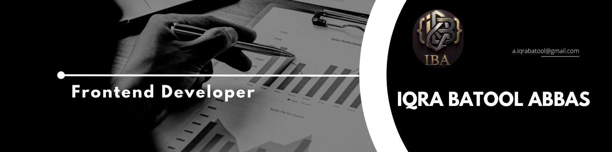

  

<h1 align="center">Hi 👋, I'm Iqra Batool Abbas</h1>

<h3 align="center">
Software Engineering Student | Aspiring Frontend Developer | Passionate About Continuous Learning
</h3>

---

# 👩‍💻 About Me

🎓 Software Engineering Student at **University of Gujrat**

💻 Aspiring **Frontend Developer** passionate about building modern, responsive, and user-friendly websites.

🌱 Currently learning **React.js**, **Modern JavaScript**, and improving my frontend development skills.

🚀 I enjoy solving real-world problems through code and continuously exploring new technologies.

🤝 Open to internships, collaborations, and exciting learning opportunities.

📍 Pakistan 🇵🇰

📧 **Email:** **a.iqrabatool@gmail.com**

---

# 💼 Experience

### Frontend Developer Intern
**Decode Labs** *(Remote Internship)*

- Completed a one-month Frontend Development Internship.
- Built responsive web pages using HTML, CSS, and JavaScript.
- Improved problem-solving and debugging skills.
- Worked on practical frontend development tasks.
- Strengthened teamwork and professional communication.

---

# 🛠 Languages & Tools

---

# 🚀 Current Goals

- 🌱 Master React.js
- 💻 Build real-world Frontend Projects
- 🤝 Contribute to Open Source
- 📚 Learn Modern Web Development
- 🎯 Secure a Software Engineering Internship

---

# 📂 Featured Projects

Coming Soon...

⭐ Responsive Portfolio Website

⭐ Weather App

⭐ To-Do Application

⭐ Landing Page Designs

---

# 🌐 Connect With Me

---

# 💡 Quote

> **"Success is built through continuous learning, consistency, and persistence."**

---

<h3 align="center">⭐ Thank You for Visiting My Profile! ⭐</h3>

If you like my work, don't forget to ⭐ my repositories.  
Let's connect and build something amazing together! 🚀

